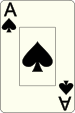
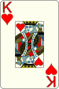
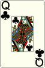
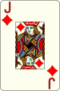
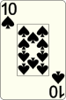
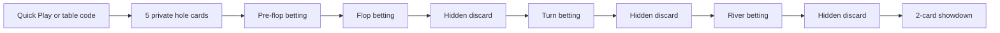

<div align="center">
  

  <h1>Hold'em, with hidden discards on every street.</h1>

  <p>
    Start with 5 hole cards. Bet like no-limit Hold'em. Discard one card in secret after the
    flop, turn, and river. Reach showdown with only 2 hole cards left.
  </p>

  <p>
    <a href="https://bondipoker.online/"><strong>Play Live</strong></a>
    &nbsp;|&nbsp;
    <a href="https://bondipoker.online/play"><strong>Quick Play Lobby</strong></a>
    &nbsp;|&nbsp;
    <a href="https://play.bondipoker.online"><strong>Play Subdomain</strong></a>
  </p>

  <p>
    
    
    
  </p>
</div>

---

## The Hook

Bondi Poker keeps the part everyone already knows, then adds one ruthless question:

> Which card are you willing to bury forever?

Every post-flop street creates a private discard decision. Nobody sees what you throw away. Nobody knows whether your story is getting stronger or falling apart. By showdown, every player has been forced from 5 hole cards down to 2.

<table>
  <tr>
    <th align="center">Deal</th>
    <th align="center">After Flop</th>
    <th align="center">After Turn</th>
    <th align="center">After River</th>
    <th align="center">Showdown</th>
  </tr>
  <tr>
    <td align="center">
      
      
      
      
      
      <br />
      <sub>5 hole cards</sub>
    </td>
    <td align="center">
      
      
      
      
      <br />
      <sub>discard 1 hidden</sub>
    </td>
    <td align="center">
      
      
      
      <br />
      <sub>discard 1 hidden</sub>
    </td>
    <td align="center">
      
      
      <br />
      <sub>discard 1 hidden</sub>
    </td>
    <td align="center">
      
      
      <br />
      <sub>best 5-card hand wins</sub>
    </td>
  </tr>
</table>

## Why It Works

| Familiar in seconds | Different for hours |
| --- | --- |
| Standard 52-card deck | Start with 5 private cards |
| No-limit Hold'em betting rhythm | Hidden discards after flop, turn, and river |
| 2-9 player table shape | Players shrink toward a 2-card reveal |
| Best 5-card poker hand wins | Every discard changes the story nobody else can see |

Bondi Poker feels familiar immediately, but the strategy is not cloned from Texas Hold'em. You can represent strength, protect equity, chase draws, or trap with a hand nobody can fully read because your discarded cards never hit the table.

## Play Flow



## Live Experience

- Quick Play gets players into the best available table fast.
- Join by code lets friends share a private 6-character table code.
- Recent tables are saved locally in the browser for quick re-entry.
- The table is designed for both mobile and desktop play.
- The bottom action tray keeps decisions clear: fold, check, call, raise, discard, rebuy, or sit out.
- Busted players get explicit `Rebuy` and `Sit Out` choices.
- Next-hand readiness is server-owned, so the table moves together.

Games are early and may not always have active public traffic. Discord and test sessions are the best way to coordinate live tables.

## What Is Running

| Surface | URL |
| --- | --- |
| Landing page | `https://bondipoker.online/` |
| Play lobby | `https://bondipoker.online/play` |
| Play subdomain | `https://play.bondipoker.online` |
| API health | `https://api.bondipoker.online/healthcheck` |

Production tracks `main`.

## Built For Real Multiplayer

Bondi Poker is not just a landing page around a rules idea. The current production stack is built around an authoritative multiplayer path:

| Layer | Role |
| --- | --- |
| `apps/web` | Next.js landing page, lobby, and table UI |
| `apps/nakama` | Authoritative Nakama runtime module |
| `packages/engine` | Deterministic poker rules engine |
| `packages/protocol` | Shared client/server message contracts |
| `apps/server` | Legacy WebSocket backend kept as an optional fallback |
| `tools/smoke` | Multiplayer smoke-test tooling |

The intended production authority is Nakama plus `@pdh/engine`. The legacy WebSocket server still exists for local/dev compatibility, but it is not the live multiplayer authority.

## Developer Quickstart

Prerequisites:

- Node.js 20+
- pnpm 9+
- Docker Desktop or Docker Engine

```bash
pnpm install
pnpm run dev
```

Open `http://localhost:3001`.

Useful local URLs:

- Web: `http://localhost:3001`
- Nakama API: `http://127.0.0.1:7350`
- Nakama console: `http://127.0.0.1:7351`
- Legacy WebSocket fallback: `ws://localhost:3002`

## Common Commands

```bash
pnpm run dev        # Nakama + Postgres + Next.js
pnpm run up         # Start Postgres + Nakama
pnpm run down       # Stop local backend containers
pnpm run logs       # Tail local backend logs
pnpm run dev:web    # Start only the Next.js client
pnpm run dev:legacy # Optional legacy websocket stack
pnpm run lint
pnpm run typecheck
pnpm run test
pnpm run build
```

## Ship It

Use `main` as the clean production branch.

```bash
pnpm ship "Describe the change"
```

`pnpm ship` stages and commits current work when needed, pushes the current branch, merges it into `main` when shipping from a feature branch, pushes `main`, and restarts production services.

For manual production operations, use `docs/PROD_RUNBOOK.md`.

## Verification

```bash
pnpm run lint
pnpm run typecheck
pnpm run test
pnpm run build
```

Live endpoint checks:

```bash
curl.exe -i https://bondipoker.online/
curl.exe -i https://bondipoker.online/play
curl.exe -i https://play.bondipoker.online/
curl.exe -i https://api.bondipoker.online/healthcheck
```

Remote smoke test:

```bash
SMOKE_SERVER_KEY='<nakama_socket_server_key>' ./scripts/remote-smoke.sh --url https://api.bondipoker.online --ssl true --clients 4
```

## Key Docs

- `docs/LOCAL_DEV.md`: local stack setup and troubleshooting.
- `docs/PROD_RUNBOOK.md`: exact production deployment flow.
- `docs/ENGINE_CONTRACT.md`: poker engine state machine and validation contract.
- `docs/PROTOCOL_CONTRACT.md`: client/server payload contract.
- `docs/DATABASE_MIGRATIONS.md`: migration and seed strategy.
- `docs/INTEGRATION_TESTS.md`: integration test harness.
- `docs/E2E_TESTS.md`: Playwright coverage.
- `docs/TROUBLESHOOTING.md`: production diagnosis and recovery.
- `docs/BACKUP_RESTORE.md`: backup and restore checklist.

## The Line

Classic poker structure. New information pressure. Fast browser play.

Bondi Poker is Hold'em with one extra decision that changes everything.
